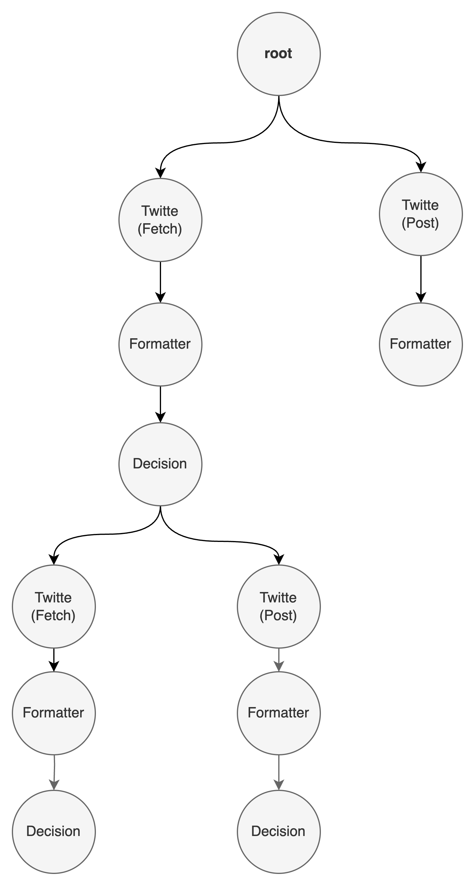

#### Solution:
Three types of nodes are used: Twitter, Formatter, and Decision.

1. `Twitter Node`: This node stores or fetches tweets.
2. `Formatter Node`: Parses or formats data according to the parent data. Since fetched tweets may contain HTML tags, they need to be converted to plain text before further processing.
3. `Decision Node`: Analyzes the sentiment of the data and routes it to the appropriate queue based on the analysis, performing operations accordingly.

#### Orchestration tree used

